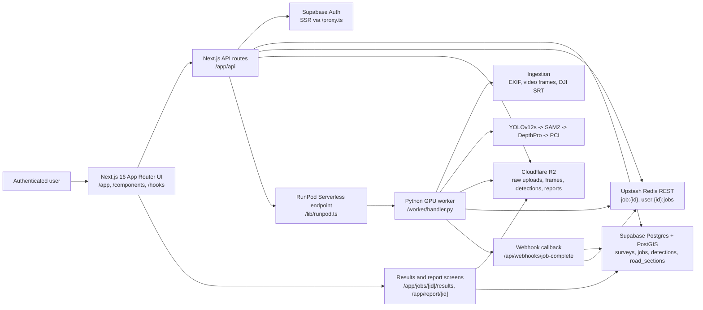
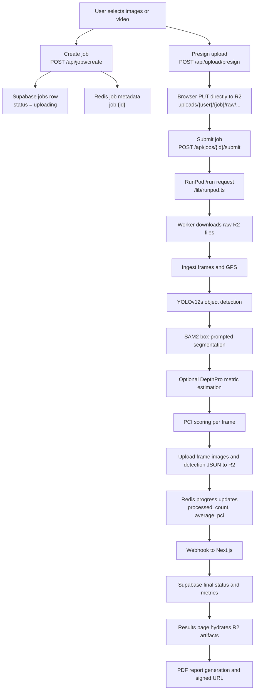
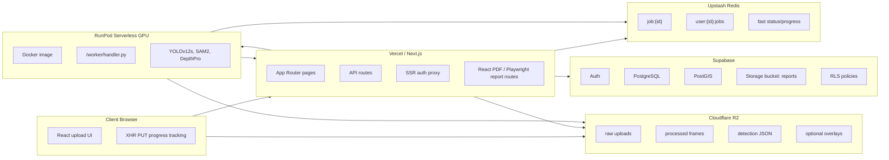

I have fully explored the Drisora repository and the associated research. Here is the complete Architectural Bible:

# Drisora Architectural Bible

Last verified locally: 2026-05-14
Repository root inspected: `/Users/sreekaraditya/Desktop/Drisora`
Research artifacts inspected:

- `/Users/sreekaraditya/Desktop/EAAI/master_research_data.md`
- `/Users/sreekaraditya/Downloads/manuscript_final.docx`
- `/Users/sreekaraditya/Downloads/Supplementary_Materials.pdf`

This document is intentionally strict about evidence. Where the repository implements something, it is described as implemented. Where a table, enum, component, or migration suggests an intended feature that is not fully wired, that gap is called out explicitly.

## 0. Repository Exploration Inventory

### Major Directories

| Area | Paths | What Lives There |
|---|---|---|
| Next.js frontend and app routes | `/Users/sreekaraditya/Desktop/Drisora/app` | App Router pages, authenticated dashboards, upload flow, job status/results pages, survey/report pages, API routes. |
| React components | `/Users/sreekaraditya/Desktop/Drisora/components` | Upload panels, dashboard UI, result views, report/PDF components, shared UI primitives. |
| Client hooks | `/Users/sreekaraditya/Desktop/Drisora/hooks` | Upload orchestration and browser-side upload state, especially `/hooks/useUpload.ts`. |
| Shared TypeScript libraries | `/Users/sreekaraditya/Desktop/Drisora/lib` | Supabase clients, Redis/RunPod/R2 helpers, job submission, result hydration, auth helpers, queue scaffold. |
| Shared types | `/Users/sreekaraditya/Desktop/Drisora/types` | Product-level TypeScript contracts, including `JobMode`, `JobStatus`, and job/result records. |
| Supabase schema | `/Users/sreekaraditya/Desktop/Drisora/supabase/migrations` | PostgreSQL/PostGIS schema, RLS policies, indexes, job lifecycle migrations, project and multi-video survey migrations. |
| RunPod worker | `/Users/sreekaraditya/Desktop/Drisora/worker` | Serverless worker entrypoint, Docker image, Python dependencies, ingestion, model pipeline, utility modules, model checkpoints. |
| Worker inference pipeline | `/Users/sreekaraditya/Desktop/Drisora/worker/pipeline` | YOLOv12s detection, SAM2 segmentation, DepthPro metric estimation, PCI scoring. |
| Worker ingestion | `/Users/sreekaraditya/Desktop/Drisora/worker/ingest` | EXIF reading, video frame extraction, DJI SRT parsing, GPS attachment. |
| Worker utilities | `/Users/sreekaraditya/Desktop/Drisora/worker/utils` | GPS frame deduplication, 100m PCI segmentation, multi-video survey helper. |
| Documentation | `/Users/sreekaraditya/Desktop/Drisora/docs` | Work logs, process notes, this architecture bible. |
| Config and environment | `/Users/sreekaraditya/Desktop/Drisora` root plus `/worker` | `package.json`, `next.config.ts`, `proxy.ts`, `.env.local`, `worker/.env.example`, `worker/Dockerfile`, `worker/R2_CORS_CONFIG.json`. |

### Key Files By Subsystem

| Subsystem | Primary Files |
|---|---|
| Frontend shell and auth | `/app/layout.tsx`, `/app/page.tsx`, `/app/dashboard/page.tsx`, `/proxy.ts`, `/lib/supabase/server.ts`, `/lib/supabase/client.ts` |
| Upload UI | `/app/upload/page.tsx`, `/components/upload/UploadClient.tsx`, `/components/upload/ImageBatchPanel.tsx`, `/components/upload/HandheldVideoPanel.tsx`, `/components/upload/DroneFootagePanel.tsx`, `/hooks/useUpload.ts` |
| Job API | `/app/api/jobs/create/route.ts`, `/app/api/upload/presign/route.ts`, `/app/api/jobs/[id]/submit/route.ts`, `/app/api/jobs/[id]/route.ts`, `/app/api/jobs/[id]/retry/route.ts`, `/app/api/jobs/[id]/results/route.ts`, `/app/api/webhooks/job-complete/route.ts` |
| Job orchestration helpers | `/lib/jobs/submit.ts`, `/lib/runpod.ts`, `/lib/redis.ts`, `/lib/queue.ts` |
| Object storage | `/lib/r2.ts`, `/worker/R2_CORS_CONFIG.json`, `/README.md` |
| Worker dispatch | `/worker/handler.py`, `/worker/main.py`, `/worker/jobs/dispatcher.py` |
| Worker ingestion | `/worker/ingest/image_batch.py`, `/worker/ingest/video_handler.py`, `/worker/ingest/srt_parser.py`, `/worker/ingest/exif_reader.py` |
| CV pipeline | `/worker/pipeline/yolo_inference.py`, `/worker/pipeline/sam2_inference.py`, `/worker/pipeline/depthpro_inference.py`, `/worker/pipeline/pci_scorer.py` |
| Geospatial/PCI utilities | `/worker/utils/gps_dedup.py`, `/worker/utils/pci_segmentation.py`, `/worker/utils/multi_video_processor.py` |
| Report generation | `/app/jobs/[id]/results/page.tsx`, `/lib/jobs/results.ts`, `/app/api/jobs/[id]/report/route.ts`, `/app/api/survey/[id]/report/route.ts`, `/app/report/[id]/page.tsx`, `/components/pdf/JobReport.tsx`, `/components/results/ReportDownloadButton.tsx` |
| Database schema | `/supabase/migrations/001_initial_schema.sql` through `/supabase/migrations/009_multi_video_survey.sql` |
| Research evidence | `/Users/sreekaraditya/Desktop/EAAI/master_research_data.md`, `/Users/sreekaraditya/Downloads/manuscript_final.docx`, `/Users/sreekaraditya/Downloads/Supplementary_Materials.pdf` |

### Important Honesty Notes

- `BullMQ` is present in `package.json` and `/lib/queue.ts`, but the current production upload/job path uses Upstash Redis REST plus RunPod Serverless submission through `/lib/jobs/submit.ts` and `/lib/runpod.ts`. The BullMQ queue appears to be a scaffold or legacy path, not the active worker dispatch path.
- The TypeScript and SQL job statuses include `segmenting` and `scoring`, but `/worker/handler.py` currently sets Redis status to `extracting_frames`, then `detecting`, then `complete` or `failed`. SAM2, DepthPro, and PCI scoring happen inside the per-frame loop without separate status transitions.
- `/worker/pipeline/sam2_inference.py` currently enriches detections with mask area and score. It does not persist full mask polygons.
- DepthPro is optional. `/worker/handler.py` enables it via upload options such as `enable_metric_analysis` or environment defaults like `DRISORA_ENABLE_DEPTHPRO_DEFAULT`; when DepthPro is unavailable, `/worker/pipeline/depthpro_inference.py` now marks depth/metric fields unavailable instead of fabricating physical measurements from pixels.
- Video uploads now default to full-frame extraction in both the upload UI and worker dispatch. `/worker/ingest/video_handler.py` supports `frame_extraction_mode: "all_frames"` and validates extracted frame counts against `ffprobe` metadata, so expected counts come from the source FPS/duration metadata rather than a sparse keyframe/interval sample or a fixed frame target.
- Reproducibility metadata is now part of the worker output. `/worker/handler.py` uploads run, frame, and processing manifests under `results/{user_id}/{job_id}/manifests/`, and `/worker/Dockerfile` sets deterministic defaults such as `PYTHONHASHSEED`, `CUBLAS_WORKSPACE_CONFIG`, `DRISORA_DETERMINISTIC_SEED`, and `DRISORA_DETERMINISTIC_EXTRACTOR`.
- D40 potholes are no longer treated as cracks for crack-width reporting. `/lib/crack-metrics.ts` filters potholes out of crack width/length estimates, and `/worker/pipeline/pci_scorer.py` handles potholes through count/area penalties and PCI caps.
- Multi-video survey support exists across `/components/upload/DroneFootagePanel.tsx`, `/app/api/survey/[id]/ingest/route.ts`, `/worker/utils/multi_video_processor.py`, and `/supabase/migrations/009_multi_video_survey.sql`, but there is schema/type drift: the ingest route uses `mode: "multi_drone_survey"` while `/types/index.ts` and `/supabase/migrations/005_jobs.sql` only allow `image_batch`, `handheld_video`, and `drone_footage`; the ingest route also writes `user_id` into `survey_videos`, but migration `009_multi_video_survey.sql` does not define that column.
- `/components/upload/DropZone.tsx` is stale or unused in the current upload surface. It references multipart routes such as `/api/upload/complete` and `/api/upload/abort` that are not part of the current direct-R2 PUT flow.
- `/worker/pipeline/geojson_builder.py`, `/worker/pipeline/spatial_dedup.py`, and `/worker/pipeline/frame_extractor.py` are empty scaffold files.

## 1. Executive Summary

Drisora is a production-oriented drone and road-survey pavement intelligence system: users upload road imagery or video, the platform stores raw evidence in Cloudflare R2, dispatches GPU inference through RunPod Serverless, tracks processing state through Upstash Redis and Supabase, and produces crack-level results plus PCI-style PDF reports. Its model choices are research-driven by an RDD2022 benchmark over 47,420 images (32,628 train, 5,757 validation, 9,035 test) comparing eight YOLO variants across countries and capture domains. The architecture is intentionally split: Next.js handles product UX and API control-plane work, Supabase/PostGIS owns identity, tenancy, relational and geospatial state, R2 owns large binary artifacts, Redis carries fast job state, and RunPod isolates GPU-heavy YOLOv12s -> SAM2 -> DepthPro inference from the web tier.

## 2. High-Level System Architecture

### 2.1 Component Overview



### 2.2 Data Flow Overview



### 2.3 Deployment View



## 3. End-to-End User-to-Report Flow

```mermaid
flowchart TD
  Start["User opens /upload"] --> AuthCheck["Supabase SSR auth check<br/>/proxy.ts"]
  AuthCheck --> Mode["Choose mode<br/>image_batch, handheld_video, drone_footage"]
  Mode --> Files["Select images, video, optional SRT/GPS options"]
  Files --> Create["POST /api/jobs/create"]
  Create --> Validate["Validate mode, manifest, file count, bytes, project ownership, GPS requirements"]
  Validate --> JobUploading["Create Supabase job + Redis job<br/>status = uploading"]
  JobUploading --> Presign["POST /api/upload/presign"]
  Presign --> PutR2["Browser XHR PUT to Cloudflare R2<br/>progress per file"]
  PutR2 --> UploadRetry{"Any upload failed?"}
  UploadRetry -->|yes| RePresign["Retry failed file with new presigned URL"]
  RePresign --> PutR2
  UploadRetry -->|no| Submit["POST /api/jobs/{id}/submit"]
  Submit --> RunPodSubmit["submitProcessingJob()<br/>POST RunPod /run"]
  RunPodSubmit --> Queued["Redis status = queued<br/>Supabase status = queued"]
  Queued --> WorkerStart["RunPod starts /worker/handler.py"]
  WorkerStart --> Download["Worker downloads raw objects from R2"]
  Download --> Extracting["Redis status = extracting_frames"]
  Extracting --> Dispatch["dispatch_job()<br/>image EXIF or video frame extraction + SRT GPS attach"]
  Dispatch --> Detecting["Redis status = detecting<br/>frame_count set"]
  Detecting --> FrameLoop["For each frame"]
  FrameLoop --> Yolo["YOLOv12s detection<br/>/worker/pipeline/yolo_inference.py"]
  Yolo --> Sam{"Detections exist?"}
  Sam -->|yes| SAM2["SAM2 segmentation from YOLO boxes<br/>/worker/pipeline/sam2_inference.py"]
  Sam -->|no| NoDet["No detection enrichment"]
  SAM2 --> Depth{"Metric analysis enabled?"}
  NoDet --> Depth
  Depth -->|yes| DepthPro["DepthPro metric depth + crack width<br/>/worker/pipeline/depthpro_inference.py"]
  Depth -->|no| SkipDepth["Use pixel-area features only"]
  DepthPro --> PCI["PCI scoring<br/>/worker/pipeline/pci_scorer.py"]
  SkipDepth --> PCI
  PCI --> UploadArtifacts["Upload frame image + detection JSON to R2"]
  UploadArtifacts --> Progress["Update Redis processed_count and progress"]
  Progress --> More{"More frames?"}
  More -->|yes| FrameLoop
  More -->|no| CompleteWorker["Compute average_pci<br/>Redis status = complete"]
  CompleteWorker --> Webhook["POST /api/webhooks/job-complete"]
  Webhook --> VerifySecret["Verify x-webhook-secret"]
  VerifySecret --> FinalDB["Service-role update Supabase jobs<br/>complete, completed_at, counts, average_pci, r2_prefix"]
  FinalDB --> ResultsPoll["/jobs/{id} polling observes complete"]
  ResultsPoll --> ResultsPage["/jobs/{id}/results hydrates R2 artifacts"]
  ResultsPage --> ReportChoice{"Report type"}
  ReportChoice --> JobPDF["GET /api/jobs/{id}/report<br/>React PDF buffer"]
  ReportChoice --> SurveyPDF["GET /api/survey/{id}/report<br/>Playwright prints /report/{id}?token=..."]
  SurveyPDF --> StoreReport["Store report PDF in Supabase Storage<br/>reports/{survey_id}/report.pdf"]
  StoreReport --> SignedURL["Return signed report URL"]
  JobPDF --> Done["Final downloadable PCI report"]
  SignedURL --> Done
```



### Actual Queue States

The product schema and types define these statuses:

```text
uploading -> queued -> extracting_frames -> detecting -> segmenting -> scoring -> complete
                                                             \-> failed
```

The active RunPod handler currently emits this shorter runtime sequence:

```text
uploading -> queued -> extracting_frames -> detecting -> complete
                                               \-> failed
```

`segmenting` and `scoring` are valid in the TypeScript/SQL contract, but `/worker/handler.py` does not currently set those states separately while it runs SAM2, DepthPro, and PCI scoring.

## 4. Core Computer Vision Inference Pipeline

### 4.1 Real Pipeline Entry Point

The real serverless inference path starts in:

- `/Users/sreekaraditya/Desktop/Drisora/worker/handler.py`
- `/Users/sreekaraditya/Desktop/Drisora/worker/jobs/dispatcher.py`

`/worker/main.py` explicitly describes itself as local testing only and not the serverless entrypoint. In production, RunPod invokes `handler.py`, which:

1. Reads the RunPod `event["input"]` payload created by `/lib/jobs/submit.ts`.
2. Downloads raw uploads from Cloudflare R2.
3. Dispatches images/video to ingestion helpers.
4. Warms or lazily loads YOLOv12s, SAM2, and DepthPro.
5. Processes every frame through `_process_frame()`.
6. Uploads frame images and detection JSON to R2.
7. Updates Redis progress.
8. Calls `/api/webhooks/job-complete`.

### 4.2 Input Modalities and Ingestion

| Mode | Frontend Sources | Worker Dispatcher | Input Shape Into CV Loop |
|---|---|---|---|
| `image_batch` | `/components/upload/ImageBatchPanel.tsx`, `/hooks/useUpload.ts` | `/worker/ingest/image_batch.py` | Each input file becomes one image frame record with optional EXIF GPS. |
| `handheld_video` | `/components/upload/HandheldVideoPanel.tsx` | `/worker/ingest/video_handler.py` | Video is sampled into frame image files with timestamps; optional SRT GPS is attached by nearest timestamp. |
| `drone_footage` | `/components/upload/DroneFootagePanel.tsx` | `/worker/ingest/video_handler.py` and `/worker/ingest/srt_parser.py` | Drone video frames carry timestamp plus optional latitude, longitude, altitude, and gimbal yaw from DJI SRT. |

Important implementation details:

- `/worker/ingest/video_handler.py` prefers ffmpeg extraction (`DRISORA_USE_FFMPEG_EXTRACTOR=1`). Default deterministic mode uses CPU ffmpeg; interval extraction may fall back to OpenCV, but `all_frames` fails closed instead of silently under-sampling.
- `/worker/ingest/srt_parser.py` parses DJI-style timestamps and GPS fields, including compact `GPS(lon,lat,alt)` patterns and altitude variants.
- `/worker/ingest/exif_reader.py` uses Pillow and piexif to extract GPS from images.
- `/worker/jobs/dispatcher.py` routes the three supported modes and returns frame records with `path`, `index`, `timestamp`, and optional `lat`, `lon`, `alt`, `gimbal_yaw`.

### 4.3 Stage 1: YOLOv12s Object Detection

**Code:** `/Users/sreekaraditya/Desktop/Drisora/worker/pipeline/yolo_inference.py`
**Model checkpoint:** `/Users/sreekaraditya/Desktop/Drisora/worker/weights/yolov12s_rdd2022.pt`
**Classes:** `D00`, `D10`, `D20`, `D40`
**Runtime:** Ultralytics YOLO, CUDA if available, CPU fallback.

The `YoloInference` wrapper loads a YOLO checkpoint and runs prediction on an image path. The code-level defaults are:

- confidence threshold: `0.25`
- IoU threshold: `0.45`
- device: `cuda` if `torch.cuda.is_available()` else `cpu`
- output class map: `{0: "D00", 1: "D10", 2: "D20", 3: "D40"}`

**Input into YOLO:**

```text
image_path: str
```

The code passes a file path directly to Ultralytics. Drisora does not currently hard-code an `imgsz` in `/worker/pipeline/yolo_inference.py`; input resizing is therefore handled by the Ultralytics runtime/model defaults unless configured externally.

**Output from YOLO per detection:**

```json
{
  "class": "D00 | D10 | D20 | D40",
  "confidence": 0.0,
  "bbox": [x1, y1, x2, y2],
  "area_px": 12345,
  "frame_index": 0
}
```

`bbox` is the central interface between YOLO and SAM2. YOLO provides coarse crack/pothole localization; SAM2 uses that coarse bounding box as a spatial prompt.

### 4.4 Stage 2: SAM2 Instance Segmentation

**Code:** `/Users/sreekaraditya/Desktop/Drisora/worker/pipeline/sam2_inference.py`
**Default model path:** `/tmp/models/sam2.1_hiera_small.pt` or `SAM2_MODEL_PATH`
**Default config:** `configs/sam2.1/sam2.1_hiera_s.yaml`

SAM2 is used as a box-prompted segmentation stage. The worker opens the frame as RGB:

```text
image = np.array(Image.open(image_path).convert("RGB"))
```

For every YOLO detection:

```text
box = np.array([x1, y1, x2, y2], dtype=np.float32)
masks, scores, _ = predictor.predict(box=box, multimask_output=True)
best_mask = masks[argmax(scores)]
```

**Input from YOLO:**

```json
{
  "bbox": [x1, y1, x2, y2],
  "class": "D00",
  "confidence": 0.87,
  "area_px": 9123
}
```

**Output after SAM2 enrichment:**

```json
{
  "bbox": [x1, y1, x2, y2],
  "class": "D00",
  "confidence": 0.87,
  "area_px": 9123,
  "mask_area_px": 2760,
  "mask_area_m2": null,
  "segmentation_score": 0.94
}
```

If SAM2 is unavailable or fails, the code degrades gracefully: detections are returned with `mask_area_px` falling back to `area_px`, `mask_area_m2` set to `None`, and a `segmentation_error` field. That means PCI scoring can still proceed from bounding-box area even when segmentation fails.

**Important limitation:** The current SAM2 stage does not persist mask polygons or run-length encoded masks. It persists compact scalar attributes such as mask area and segmentation score.

### 4.5 Stage 3: Apple DepthPro Metric Depth and Crack Width

**Code:** `/Users/sreekaraditya/Desktop/Drisora/worker/pipeline/depthpro_inference.py`
**Default model path:** `/tmp/models/depth_pro.pt` or `DEPTHPRO_MODEL_PATH`
**Docker install:** `/Users/sreekaraditya/Desktop/Drisora/worker/Dockerfile` installs DepthPro from Apple GitHub source.

DepthPro is the metric interpretation stage. It is optional and controlled through request options and environment defaults in `/worker/handler.py`:

- upload option: `enable_metric_analysis`
- upload option: `enable_depthpro`
- env default: `DRISORA_ENABLE_DEPTHPRO_DEFAULT`

**Input into DepthPro:**

```text
image_path: str
detections: list enriched by YOLO and SAM2
```

DepthPro loads the image with Pillow, applies the DepthPro transform, and calls:

```text
prediction = model.infer(tensor)
depth_map = prediction["depth"].squeeze().cpu().numpy().astype(np.float32)
focal_length_px = prediction.get("focallength_px")
```

If focal length is missing, the code estimates it from image width and a fixed field of view:

```text
focal_length_px = width / (2 * tan(FOV_RADIANS / 2))
```

**Output after DepthPro enrichment:**

```json
{
  "depth_m": 1.23,
  "camera_surface_distance_m": 1.23,
  "pixel_size_m": 0.0017,
  "mask_area_m2": 0.0042,
  "crack_width_mm": 6.8
}
```

DepthPro estimates:

- local depth around the defect box/mask
- pixel-to-meter scale from depth and focal length
- metric mask area in square meters
- approximate crack width in millimeters for crack classes

The crack-width approximation divides segmented area by the longer side of the detection box, then scales pixels to meters:

```text
crack_width_mm ~= (mask_area_px / max(box_width_px, box_height_px)) * pixel_size_m * 1000
```

For `D40` potholes, the code does not treat the object as a crack-width measurement. Potholes contribute through area/count pathways in the PCI scorer.

### 4.6 PCI Scoring

**Code:** `/Users/sreekaraditya/Desktop/Drisora/worker/pipeline/pci_scorer.py`
**Standard label in code:** `IRC:82-2023`
**Current scoring version:** `drisora_pci_v1`

The scorer accepts the frame path, final detections, and optional depth map. It computes distress-specific sub-scores:

| Distress | Code Path | Signal |
|---|---|---|
| Cracking | `_score_cracking` | `D00`, `D10`, `D20` extent from `mask_area_m2` when available, otherwise pixel area ratio. |
| Potholes | `_pothole_count`, `_pothole_extent_pct`, `_pothole_cap` | `D40` count and pixel-area extent. Potholes are not used for crack-width estimation. |
| Rutting | `_score_rut` | Depth-map variation over the top third of the image. |
| Roughness | `individual_scores["roughness"]` | Currently set to `100.0` unless a measured roughness signal is added later. |
| Ravelling | `_score_ravelling` | Placeholder/default sub-score. |
| Patching | `_score_patching` | Placeholder/default sub-score. |

The weighted PCI is:

```text
PCI =
  0.40 * roughness_score +
  0.16 * pothole_score +
  0.14 * rut_score +
  0.12 * cracking_score +
  0.10 * ravelling_score +
  0.08 * patching_score
```

Then the score is capped by pothole severity:

| Pothole Signal | PCI Cap |
|---|---:|
| Any pothole | 78 |
| `count >= 2` or `extent >= 1%` | 65 |
| `count >= 4` or `extent >= 3%` | 50 |
| `count >= 8` or `extent >= 6%` | 35 |
| `count >= 12` or `extent >= 10%` | 25 |

This is a pragmatic application-level safety rule, not a claim that the current implementation is a certified PCI standard engine. It prevents a single D40 detection from being softened by the weighted average and prevents impossible outputs such as pothole crack width in millimeters.

Condition labels are:

| Score Range | Condition |
|---|---|
| `> 90` | Excellent |
| `> 80` | Good |
| `> 60` | Satisfactory |
| `> 40` | Fair |
| `> 20` | Poor |
| `<= 20` | Failed |

The scorer returns:

```json
{
  "pci_score": 83.2,
  "condition": "Good",
  "recommendation": "...",
  "metrics": {
    "standard": "IRC:82-2023",
    "cracking": {},
    "potholes": {},
    "rut_depth": {},
    "roughness": {}
  }
}
```

### 4.7 Why YOLO -> SAM2 -> DepthPro

This sequence is a pragmatic split between speed, localization, and metric interpretation:

1. **YOLOv12s is the fast objectness/classification front end.** It identifies likely distress boxes and classes cheaply enough for batch processing.
2. **SAM2 improves spatial precision only where YOLO already found candidate defects.** Full-image segmentation is expensive and less constrained; box prompting makes SAM2 act as a local mask refiner.
3. **DepthPro turns pixel defects into metric features.** PCI reporting needs more than "there is a crack"; it benefits from area, width, and surface-distance estimates. DepthPro supplies an approximate metric scale without requiring stereo or LiDAR.
4. **PCI scoring consumes compact, fault-tolerant features.** The scorer can use metric features when present, but metric fields are now explicitly marked unavailable when DepthPro cannot run; potholes are scored by count/extent rather than fake width.

The research supports this design. The RDD2022 work found that cross-domain country/capture shift dominates model-family differences: architecture changes among YOLO variants move aggregate mAP50 by only single-digit percentage points, while country/capture domain movement can exceed 70 percentage points for the same architecture. That makes the pipeline design more valuable than merely chasing a larger detector: local segmentation, metric calibration, GPS context, and explainable report generation compensate for the detector's domain fragility.

## 5. Job Orchestration and Production ML System

### 5.1 Active Control Plane

The active job control plane is implemented by:

- `/app/api/jobs/create/route.ts`
- `/app/api/upload/presign/route.ts`
- `/app/api/jobs/[id]/submit/route.ts`
- `/lib/jobs/submit.ts`
- `/lib/runpod.ts`
- `/lib/redis.ts`
- `/app/api/webhooks/job-complete/route.ts`
- `/worker/handler.py`

Job creation writes durable relational state to Supabase and fast state to Upstash Redis:

```text
Supabase jobs row:
  job id, user_id, mode, status, file_count, total_bytes, gps_available,
  r2_prefix, project_id, average_pci, processed_count

Redis:
  job:{id} -> full job metadata and progress
  user:{user_id}:jobs -> user job index
```

### 5.2 RunPod Dispatch

`/lib/runpod.ts` builds a request to:

```text
https://api.runpod.ai/v2/{RUNPOD_ENDPOINT_ID}/run
```

with:

```json
{
  "input": {
    "job_id": "...",
    "user_id": "...",
    "mode": "drone_footage",
    "files": [...],
    "options": {...},
    "r2_prefix": "uploads/{user}/{job}"
  }
}
```

`/lib/jobs/submit.ts` sets the Redis job to `queued`, resets progress counters, records RunPod metadata, and persists the submitted state. `/app/api/jobs/[id]/submit/route.ts` also updates Supabase to `queued`.

### 5.3 RunPod Worker Runtime

`/worker/Dockerfile` packages the GPU runtime:

- base image: `pytorch/pytorch:2.4.1-cuda12.1-cudnn9-runtime`
- system packages: ffmpeg, git, libgl, libglib
- Python dependencies: `runpod`, `ultralytics`, `opencv-python-headless`, `boto3`, `supabase`, `redis`, etc.
- external model libraries: Apple DepthPro and Meta SAM2 installed from GitHub
- copied artifacts: `worker/weights`, `worker/models`, `worker/pipeline`, `worker/ingest`, `worker/utils`
- command: `python handler.py`

The handler uses environment variables for R2, Redis, callback URL, webhook secret, and model behavior flags.

### 5.4 Failure and Retry Behavior

| Failure Point | Handling in Code |
|---|---|
| Invalid upload request | `/api/jobs/create` and `/api/upload/presign` validate modes, ownership, file manifests, file counts, and job state. |
| Browser upload failure | `/hooks/useUpload.ts` tracks per-file errors, retries failed files by requesting new presigned URLs, and only submits once all files are uploaded. |
| RunPod submit failure | `/api/jobs/[id]/submit` marks the Supabase job `failed` if dispatch fails. |
| Video under-extraction | `/worker/ingest/video_handler.py` validates extracted frame count against ffprobe metadata and fails the job when extraction is far below the expected all-frame or interval count. |
| Worker frame-level failure | `_process_frame()` in `/worker/handler.py` catches exceptions and returns a fallback frame result rather than killing the whole job. |
| Worker job-level failure | Outer exception handler sets Redis `failed`, records `error`, and posts a failed webhook. |
| Webhook-only inconsistency | `/app/api/jobs/[id]/route.ts` contains normalization logic for a known webhook-only failure pattern when `average_pci` and processed counts indicate the worker actually completed. |
| User retry | `/app/api/jobs/[id]/retry/route.ts` allows retry of failed Supabase jobs using existing Redis metadata and RunPod resubmission. |

### 5.5 BullMQ Reality Check

`/lib/queue.ts` defines a BullMQ `surveyQueue` with:

- queue name: `survey-analysis`
- attempts: `3`
- exponential backoff: `delay: 2000`
- `removeOnComplete`
- `removeOnFail`

However, the active upload/job routes do not enqueue through `surveyQueue`. They submit directly to RunPod through `/lib/jobs/submit.ts`. Also, `/lib/queue.ts` appears to pass `UPSTASH_REDIS_REST_URL` directly as an ioredis host, which is not sufficient for a normal BullMQ TCP connection without proper host/port/TLS mapping. In interviews, this should be described as an architectural scaffold, not as the current production queue.

## 6. Cloudflare R2 Upload and Storage Flow

### 6.1 Direct Browser Uploads

The upload path is direct-to-R2:

1. Browser asks Drisora to create a job: `/api/jobs/create`.
2. Browser asks for presigned PUT URLs: `/api/upload/presign`.
3. Browser uses XHR PUT directly to Cloudflare R2.
4. Browser tracks progress and retries failed files in `/hooks/useUpload.ts`.
5. Browser submits the job only after upload completion: `/api/jobs/{id}/submit`.

This keeps large video/image payloads off the Vercel/Next.js serverless request body path.

### 6.2 R2 Helper Layer

**Code:** `/Users/sreekaraditya/Desktop/Drisora/lib/r2.ts`

The helper constructs an AWS-compatible S3 client:

```text
endpoint = https://{CLOUDFLARE_R2_ACCOUNT_ID}.r2.cloudflarestorage.com
region = auto
credentials = CLOUDFLARE_R2_ACCESS_KEY_ID / CLOUDFLARE_R2_SECRET_ACCESS_KEY
```

It exposes:

- `getPresignedPutUrl`
- `getPresignedGetUrl`
- `listR2Objects`
- `getR2ObjectText`

### 6.3 Object Layout

The current code uses a predictable prefix strategy:

```text
uploads/{user_id}/{job_id}/raw/{filename}
results/{user_id}/{job_id}/frames/{frame_name}
results/{user_id}/{job_id}/detections/{frame_stem}.json
```

Survey report PDFs generated through `/app/api/survey/[id]/report/route.ts` are stored in Supabase Storage, not R2:

```text
reports/{survey_id}/report.pdf
```

### 6.4 Security Properties

- Users never receive permanent R2 credentials.
- `/api/upload/presign` checks Supabase auth, Redis job ownership, job status, and file-manifest consistency before issuing PUT URLs.
- Uploads are constrained to `uploads/{user.id}/{job.id}/raw/{filename}` prefixes.
- R2 CORS is explicitly configured in `/worker/R2_CORS_CONFIG.json` for `https://drisora.vercel.app` and local development.
- Webhook updates require `x-webhook-secret` validated by `/app/api/webhooks/job-complete/route.ts`.

### 6.5 Upload UX and Retry

`/hooks/useUpload.ts` owns browser-side upload state. It sanitizes filenames, creates a storage manifest, uploads by XHR so progress can be measured, retries failed uploads with fresh presigned URLs, and only transitions from `uploading` to submitted processing after successful object upload.

## 7. Backend, Database, and Multi-Tenancy

### 7.1 Supabase/PostgreSQL/PostGIS Architecture

Drisora uses Supabase for:

- authentication
- SSR session refresh and protected routing
- PostgreSQL relational state
- PostGIS geospatial storage/indexing
- RLS-based tenant isolation
- Supabase Storage for generated survey PDFs

Core clients:

- `/lib/supabase/client.ts` creates the browser client.
- `/lib/supabase/server.ts` creates the server client and service-role client.
- `/proxy.ts` refreshes SSR auth with `supabase.auth.getUser()` and protects authenticated route prefixes.

### 7.2 Key Tables

| Table | Source Migration | Purpose |
|---|---|---|
| `profiles` | `001_initial_schema.sql`, extended by `008_projects_crack_metrics.sql` | User profile, organization metadata, avatar/notification preferences. |
| `surveys` | `001_initial_schema.sql` | Road survey parent records with metadata and ownership. |
| `upload_parts` | `001_initial_schema.sql` | Legacy/resumable multipart upload metadata. |
| `road_sections` | `001_initial_schema.sql`, extended by `008_projects_crack_metrics.sql` | Segment-level road geometry and PCI/crack metrics. |
| `detections` | `001_initial_schema.sql`, extended by `008_projects_crack_metrics.sql` | Crack/pothole detections with geospatial point locations and crack metrics. |
| `jobs` | `001_initial_schema.sql`, reshaped by `005`, `006`, `007`, `008` | Upload and inference lifecycle records. |
| `projects` | `008_projects_crack_metrics.sql` | Project grouping and ownership. |
| `survey_videos` | `009_multi_video_survey.sql` | Per-video metadata for multi-video survey ingestion. |
| `processed_zones` | `009_multi_video_survey.sql` | GPS footprint/deduplication support for processed video zones. |
| `pci_segments` | `009_multi_video_survey.sql` | 100m PCI segment records for longitudinal reporting. |

### 7.3 Geospatial Features

PostGIS is enabled in `/supabase/migrations/001_initial_schema.sql`. The schema uses:

- `GEOMETRY(LINESTRING, 4326)` for `road_sections.geom`
- `GEOMETRY(POINT, 4326)` for `detections.location`
- GIST spatial indexes in `/supabase/migrations/003_spatial_indexes.sql`
- 100m segment concepts in `/worker/utils/pci_segmentation.py`
- GPS footprint overlap and deduplication in `/worker/utils/gps_dedup.py`

This is a strong architectural choice: raw detections are not just UI annotations; they are geospatial assets that can be mapped, queried, segmented, and aggregated over roads.

### 7.4 Row-Level Security

RLS is implemented in `/supabase/migrations/002_rls_policies.sql` and extended in later migrations. The core policy pattern is:

```text
auth.uid() = user_id
```

or ownership through parent relationships, for example detections belonging to road sections whose surveys belong to the authenticated user. Service-role code is reserved for trusted backend operations such as webhook finalization and server-side report generation.

### 7.5 Multi-Tenancy Model

Drisora is user-centric multi-tenant today:

- Authenticated users own jobs, surveys, projects, and profile records.
- RLS prevents cross-user reads/writes.
- Project membership is currently lightweight ownership rather than a full organization/team membership model.
- `profiles.organization` exists, but the inspected schema is not yet a full enterprise multi-org RBAC model.

## 8. Major Architectural Decisions and Trade-Offs

| Component | Decision Taken | Alternatives Considered | Why This Was Chosen | Key Trade-offs | Real Impact (from code or benchmark) |
|---|---|---|---|---|---|
| Detector model | Use YOLOv12s checkpoint `worker/weights/yolov12s_rdd2022.pt` | YOLOv5s, YOLOv8s, YOLOv9s, YOLOv10s, YOLOv11s, YOLOv12n, YOLOv12m | YOLOv12s had the best mean across the country matrix in `/Users/sreekaraditya/Desktop/EAAI/master_research_data.md` and is smaller than YOLOv12m. | YOLOv12m was best on global seed0 aggregate mAP50, so YOLOv12s is an efficiency/cross-domain-rank choice rather than universally highest aggregate accuracy. | Research: YOLOv12s mean country matrix 0.4763; YOLOv12m 0.4752. Global seed0: YOLOv12m 0.6325, YOLOv12s 0.6192. |
| Domain-shift posture | Treat domain shift as the main risk, not detector architecture alone | Keep scaling detector family or train one-off country models | The benchmark found YOLOv12s ranged from 0.2197 mAP50 on Norway to 0.9265 on China motorbike, a 70.7 percentage-point swing, while architecture spread was 6.3 percentage points. | Requires downstream calibration, segmentation, metric analysis, and honest uncertainty rather than model-only confidence. | Manuscript: architecture range 0.5694-0.6325 mAP50; YOLOv12s country/capture span 70.7 pp; ratio about 11.2x. |
| Statistical model choice | Use rank/stability evidence, not just a single leaderboard row | Pick highest single dataset mAP | Friedman/Nemenyi results favor YOLOv12s rank but show only some pairwise significance. | More nuanced interview story; cannot claim YOLOv12s dominates every setting. | Research: YOLOv12s mean rank 2.14; significant versus YOLOv10s and YOLOv12n under the reported Nemenyi CD. |
| Resolution handling | Use the trained YOLOv12s detector, with research showing higher input resolution helps | 480px, 640px, 800px variants | Resolution ablation found 800px improved mAP50 and recall versus 480px. | Current code does not explicitly set `imgsz`; actual inference shape depends on Ultralytics/model defaults. | Research: YOLOv12s 800px mAP50 0.6259 vs 480px 0.5822, +0.0437 mAP50. |
| Fine-tuning strategy | Do not blindly fine-tune on small India slices | Country-specific fine-tuning with 10%, 15%, 20% India data | Research showed marginal India gains at 10% and degradation/catastrophic forgetting at higher fractions. | Strong argument for domain-aware data strategy and evaluation before deployment retraining. | Research: 10% India mean 0.2906 vs baseline 0.2808; 15/20% reduced India or hurt Japan/US heavily. |
| Detector post-processing | Keep NMS behavior explicit in benchmark interpretation | Compare YOLOv10s naively without NMS patch | Research notes YOLOv10s standard NMS patch recovers performance. | Avoids unfair architectural conclusions. | Research: YOLOv10s standard NMS recovered +0.0543 mAP50. |
| CV sequence | YOLO -> SAM2 -> optional DepthPro -> PCI | End-to-end segmentation model; YOLO-only reports; DepthPro-only scene analysis | YOLO finds candidates quickly, SAM2 refines masks locally, DepthPro adds metric scale, PCI consumes explainable distress features. | More moving parts and GPU dependency; model-loading complexity. | Implemented in `/worker/handler.py` via `yolo_inference.py`, `sam2_inference.py`, `depthpro_inference.py`, `pci_scorer.py`. |
| SAM2 usage | Use YOLO boxes as SAM2 prompts | Full-frame segmentation or hand-drawn prompts | Box prompting constrains SAM2 to likely defects and reduces ambiguity. | Current implementation stores scalar mask area, not full mask geometry. | `/worker/pipeline/sam2_inference.py` calls `predictor.predict(box=..., multimask_output=True)`. |
| DepthPro usage | Optional metric depth and crack-width estimation only when the model succeeds | Require LiDAR/stereo; ignore metric measurements | Monocular depth provides approximate metric context for uploaded videos/images. | Approximate scale; depends on focal estimate and image conditions. Disabled unless option/env enables it. Failed metric analysis is now explicit rather than silently converted from pixels. | `/worker/pipeline/depthpro_inference.py` computes `pixel_size_m`, `mask_area_m2`, and `crack_width_mm` only when metric scale is available; fallback output uses `metric_error`. |
| GPU execution | RunPod Serverless worker | Persistent GPU VM, self-hosted Kubernetes GPU nodes, CPU inference | Serverless GPU keeps web tier light and can scale bursts without always-on GPU cost. | Cold starts, model download/load latency, external platform dependency, webhook failure modes. | `/lib/runpod.ts` submits to RunPod `/run`; `/worker/Dockerfile` packages CUDA/PyTorch worker. |
| Job state | Upstash Redis REST as fast state, Supabase as durable state | Supabase-only polling; BullMQ-only queue; in-process state | Redis gives low-latency progress updates and simple serverless access; Supabase persists final records. | Dual-write consistency risk; requires normalization logic for edge cases. | `/lib/jobs/submit.ts`, `/app/api/jobs/[id]/route.ts`, and `/worker/handler.py` all update or read Redis job state. |
| BullMQ | Present but not active production path | Full BullMQ worker with TCP Redis | BullMQ may have been intended for survey queue orchestration. | Current `/lib/queue.ts` should not be described as active queue processing. | Package and file exist; active submit path bypasses `surveyQueue`. |
| Object storage | Cloudflare R2 for raw and processed artifacts | AWS S3, Supabase Storage, local disk | R2 supports S3-compatible APIs and direct browser PUTs with no app-server file proxying. | Requires CORS, presigned URL hygiene, and object-prefix discipline. | `/lib/r2.ts` uses AWS SDK S3Client against Cloudflare endpoint; `/hooks/useUpload.ts` uploads direct. |
| Report PDF storage | Supabase Storage for survey PDFs | Store report PDFs in R2; generate only on demand | Supabase Storage integrates with service-role upload and signed URLs in report route. | Split storage story: raw/results in R2, generated survey reports in Supabase Storage. | `/app/api/survey/[id]/report/route.ts` stores `reports/{survey_id}/report.pdf`. |
| Backend platform | Next.js API routes plus Supabase | Separate FastAPI/Express backend | Keeps product, auth, API, upload control plane, and report routes in one deployable app. | Serverless limits; GPU and long-running work must stay outside Next.js. | `/app/api` implements create/presign/submit/results/report/webhook. |
| Database | Supabase Postgres + PostGIS + RLS | Self-hosted Postgres/FastAPI auth; MongoDB; object-only metadata | PostGIS matches road geometry; RLS gives tenant isolation quickly; Supabase Auth simplifies SSR. | SQL migrations must stay synced with TS types and API routes. Current multi-video drift proves this needs discipline. | `001`, `002`, `003`, `008`, `009` migrations show PostGIS, RLS, projects, crack metrics, PCI segments. |
| Upload strategy | Presigned PUT direct from browser to R2 | Multipart through server; Vercel API body upload; Supabase Storage upload | Avoids serverless payload/time limits and gives progress tracking. | More complex client state and retry logic. | `/hooks/useUpload.ts` XHR PUTs directly and retries with fresh presigned URLs. |
| Auth routing | SSR session refresh in `proxy.ts` using `supabase.auth.getUser()` | Client-only auth guards; legacy middleware behavior | Prevents protected pages from rendering with stale auth and follows current Next.js convention. | Requires careful route allowlist, especially report token bypass. | `/proxy.ts` protects app prefixes and allows `/report/[id]?token=...`. |
| Geospatial model | Store detections and sections with PostGIS geometry | Store only JSON lat/lon | Enables spatial indexes, route maps, road sections, and 100m PCI segmentation. | Requires geometry migrations and geospatial correctness. | `road_sections.geom`, `detections.location`, GIST indexes, `/worker/utils/pci_segmentation.py`. |

## 9. Research-Driven Design Insights

The RDD2022 benchmark directly shaped Drisora's architecture in five ways.

### 9.1 Scale and Dataset Framing

The inspected manuscript reports a 47,420-image RDD2022 split:

```text
32,628 training images
5,757 validation images
9,035 test images
```

This is large enough to compare detector families meaningfully, but the country/capture results show that scale alone does not remove domain shift.

### 9.2 Eight-Model YOLO Comparison

The research compared:

```text
YOLOv5s
YOLOv8s
YOLOv9s
YOLOv10s
YOLOv11s
YOLOv12n
YOLOv12s
YOLOv12m
```

The key architectural result is not "newest always wins." The local research data shows YOLOv12s as the best mean model across the country matrix, while YOLOv12m wins the global seed0 aggregate. That justifies YOLOv12s as a production speed/accuracy compromise, not as an unqualified universal winner.

### 9.3 Domain Shift Dominates Architecture

The strongest product insight is that domain shift is far larger than YOLO-family choice:

- aggregate architecture mAP50 range: approximately 6.3 percentage points
- YOLOv12s country/capture range: 70.7 percentage points
- reported ratio: about 11.2x

That means Drisora should not be sold as "we picked the newest detector and solved road damage." The real architecture must include:

- GPS/geospatial context
- second-stage segmentation
- metric feature extraction
- reviewable reports
- route-level aggregation
- future active learning and country-specific evaluation

### 9.4 Friedman/Nemenyi Ranking Matters

The research uses Friedman/Nemenyi testing rather than only leaderboard sorting. YOLOv12s has the strongest reported mean rank, but not every pairwise gap is statistically significant. In interviews, the mature answer is:

> We chose YOLOv12s because it was the best small-scale ranked model in our cross-domain matrix and had a strong cost/latency profile, while we remained aware that YOLOv12m can win some aggregate settings.

### 9.5 India Fine-Tuning and Catastrophic Forgetting

The India fine-tuning experiments are a cautionary result:

- 10% India fine-tuning slightly improved India mean mAP50.
- Larger 15% and 20% variants did not monotonically improve India.
- Japan and US performance degraded in some fine-tuned variants.

The architectural consequence is that Drisora should avoid automatic per-region fine-tuning without regression tests across other domains. A safer roadmap is calibration, active learning, domain-balanced fine-tuning, and clear model-version evaluation.

### 9.6 Localization Ceiling Pushes Segmentation

The manuscript notes a low mAP50-95 ceiling, which implies localization precision is a bottleneck. That is exactly why the production pipeline does not stop at YOLO boxes. SAM2 exists in the pipeline to refine localization into mask areas, and DepthPro exists to translate those areas into approximate physical quantities.

## 10. Scaling, Cost, Failure Modes, and Monitoring

### 10.1 Scaling Behavior

| Layer | Current Scaling Behavior |
|---|---|
| Next.js/Vercel | Handles UI, auth-gated API routes, presign, submit, polling, report routes. It is kept out of large upload payloads and GPU inference. |
| Cloudflare R2 | Scales binary uploads/downloads; browser uploads directly to R2 rather than proxying through Vercel. |
| Upstash Redis | Scales status reads/writes for progress polling and worker updates. |
| Supabase | Stores durable relational and geospatial state. Performance depends on indexes, RLS policy cost, and query design. |
| RunPod Serverless | Scales GPU processing by serverless workers, subject to cold starts, endpoint concurrency, model load time, and platform quotas. |

### 10.2 Current Scaling Limits

- Large video jobs still run as one RunPod job that loops frames sequentially in `/worker/handler.py`.
- SAM2 and DepthPro model loading can dominate cold-start latency.
- The worker uploads one detection JSON per frame; very large surveys can produce many small R2 objects.
- Results hydration in `/lib/jobs/results.ts` batches detection JSON fetches, but very large jobs still require careful pagination/caching.
- Supabase tables have spatial indexes, but long-term production scale will need query plans and retention policies.
- The multi-video survey path is not fully schema/type aligned yet.

### 10.3 Cost Considerations

| Cost Driver | Current Mitigation |
|---|---|
| GPU inference | Serverless RunPod avoids always-on GPU spend. |
| Object storage | R2 is used for large raw and processed artifacts. |
| Egress and signed reads | Result hydration uses presigned URLs and object listing; repeated report/results views can increase reads. |
| Database | Supabase stores metadata and geospatial state rather than raw binaries. |
| Report generation | PDFs are generated on demand; survey reports are stored for later signed access. |

### 10.4 Failure Modes

| Failure Mode | Existing Handling | Missing or Suggested Improvement |
|---|---|---|
| Upload interruption | Client retry in `/hooks/useUpload.ts`. | Persist resumable upload session detail beyond current manifest if uploads become huge. |
| R2 CORS misconfiguration | CORS config documented and present. | Add an automated deployment check that verifies PUT from allowed origin. |
| RunPod cold start or timeout | Job can fail and be retried. | Add explicit timeout classification and user-facing "worker unavailable" state. |
| Worker model load failure | Worker catches job-level failure and posts failed webhook. | Add health/warmup endpoint or startup validation logs. |
| SAM2 frame failure | Frame falls back to box area. | Expose degraded-analysis flags in UI/report more clearly. |
| DepthPro failure | Depth/metric fields are marked unavailable with `metric_error`; fabricated metric area/depth is no longer emitted. | Surface metric-quality flags directly in the report UI. |
| Webhook failure | Redis remains source for job polling; route has normalization logic for one webhook-only failure pattern. | Add idempotent webhook event log table. |
| Redis/Supabase mismatch | Some normalization exists in `/api/jobs/[id]/route.ts`. | Add a reconciliation job and explicit state machine tests. |
| Schema/type drift | Not automatically handled. | Fix `multi_drone_survey` mode and `survey_videos.user_id` drift before relying on multi-video production ingestion. |

### 10.5 Monitoring Today

Current monitoring is primarily:

- console logs in worker and API routes
- Redis job state and progress
- Supabase job status, counts, errors, and timestamps
- RunPod execution metadata
- R2 artifact existence

What is missing:

- centralized structured logs
- Sentry or equivalent exception tracking
- OpenTelemetry traces across browser -> Next.js -> RunPod -> webhook
- queue depth and worker concurrency dashboard
- model-level quality monitoring by country, device, road type, and weather
- explicit degraded-analysis flags surfaced in the final PDF

## 11. Interview-Ready Explanations

### 11.1 "Walk me through the full system architecture."

Drisora is split into a control plane and an inference plane. The control plane is a Next.js 16 App Router app backed by Supabase Auth, Postgres/PostGIS, Upstash Redis, and Cloudflare R2. The browser creates a job, uploads raw images or videos directly to R2 using presigned PUT URLs, and then submits the job. The inference plane is a RunPod Serverless GPU worker packaged in Docker. It downloads the raw objects from R2, extracts frames and GPS, runs YOLOv12s, SAM2, optional DepthPro, computes PCI, writes detection artifacts back to R2, updates Redis progress, and sends a completion webhook to the Next.js app so Supabase has the durable final state.

### 11.2 "Explain your 3-stage CV pipeline."

The pipeline is YOLOv12s -> SAM2 -> DepthPro. YOLOv12s is the fast detector that produces class labels and bounding boxes for RDD2022 distress classes like D00, D10, D20, and D40. Those boxes become prompts for SAM2, which refines each detection into a local mask area. If metric analysis is enabled and succeeds, DepthPro estimates scene depth and pixel scale so the system can approximate crack width and area in physical units. D40 potholes are not treated as crack-width objects. The PCI scorer combines cracking, pothole, rut, roughness, ravelling, and patching sub-scores, then applies pothole caps in `drisora_pci_v1`.

### 11.3 "Why did you choose YOLOv12s?"

The choice came from an eight-model RDD2022 benchmark, not from guessing. We compared YOLOv5s through YOLOv12m. YOLOv12s had the best mean rank across the country/capture matrix and a strong speed/accuracy trade-off for production inference. I would not claim it dominated every aggregate number: YOLOv12m won the global seed0 aggregate. The reason YOLOv12s made sense for Drisora is that it gave near-top accuracy with a smaller model footprint, and the research showed domain shift was far larger than architecture differences anyway.

### 11.4 "What did the benchmark teach you?"

The benchmark taught us that pavement detection is dominated by domain shift. Architecture changes across YOLO variants moved aggregate mAP50 by around 6.3 percentage points, but the same YOLOv12s model ranged by about 70.7 percentage points across countries/capture modes. That is why the product architecture includes segmentation, metric estimation, GPS/geospatial context, and report-level aggregation instead of relying only on detector confidence.

### 11.5 "How does the job queue handle failures?"

The active path uses Redis as fast job state and Supabase as durable state. Jobs start as `uploading`, become `queued` after RunPod submission, then the worker updates Redis during extraction and detection. Browser upload failures are retried client-side with fresh presigned URLs. RunPod submission failures mark Supabase jobs failed. Worker frame-level exceptions return fallback frame results, while job-level exceptions set Redis to failed and call the webhook. There is also a user retry API for failed jobs. BullMQ exists in the codebase, but the production dispatch path currently submits directly to RunPod rather than using BullMQ workers.

### 11.6 "Why RunPod Serverless instead of persistent GPUs?"

The web app should not own GPU lifecycle. RunPod Serverless lets Drisora pay for GPU work when surveys are processed, package the heavy CUDA/PyTorch/SAM2/DepthPro environment in Docker, and keep Vercel focused on product/API work. The trade-off is cold-start latency, external platform dependency, and the need for webhooks plus idempotent state updates.

### 11.7 "Why Cloudflare R2?"

R2 is used because road surveys are binary-heavy: videos, frames, detection JSON, and overlays do not belong in Postgres or in Vercel request bodies. The browser uploads directly to R2 using presigned PUT URLs, which avoids serverless upload limits and gives progress tracking. Supabase stores metadata and geospatial records; R2 stores the heavy artifacts.

### 11.8 "How is multi-tenancy enforced?"

Supabase Auth identifies users, `/proxy.ts` protects authenticated pages with SSR session refresh, and PostgreSQL RLS policies isolate rows by `auth.uid()` or ownership through parent records. Jobs, projects, surveys, detections, road sections, and related records are user-owned. Service-role access is only used for trusted backend operations like webhook finalization and report generation.

### 11.9 "What were the biggest technical challenges?"

The main challenges were turning research-grade CV into a product-grade asynchronous pipeline: handling huge uploads without proxying through the app server, keeping GPU inference isolated from the web tier, tracking progress reliably across Redis and Supabase, making YOLO outputs useful enough for engineering reports through SAM2 and DepthPro, and dealing honestly with domain shift. The hardest research lesson was that the detector family matters less than the country and capture domain, so the system had to be designed for calibration and traceability.

### 11.10 "What would you improve next?"

I would first fix schema/type drift in the multi-video survey path, then make the worker status machine match the product states by emitting `segmenting` and `scoring`, add structured observability across Next.js, RunPod, Redis, and Supabase, and persist richer SAM2 outputs where useful. After that I would add model-versioned evaluation so every fine-tune is checked across countries before deployment.

## 12. Learning and Ownership Roadmap for the Developer

1. **Write a job lifecycle state-machine test.**
   Study `/types/index.ts`, `/supabase/migrations/005_jobs.sql`, `/app/api/jobs/create/route.ts`, `/app/api/jobs/[id]/submit/route.ts`, and `/worker/handler.py`. Add a small test or typed helper proving allowed transitions and exposing the current missing `segmenting`/`scoring` emissions.

2. **Fix multi-video schema/type drift.**
   Align `/app/api/survey/[id]/ingest/route.ts`, `/types/index.ts`, and `/supabase/migrations/009_multi_video_survey.sql`. Decide whether `multi_drone_survey` is a real `JobMode`, and either add it everywhere or remove it from the ingest path. Also resolve the `survey_videos.user_id` insert mismatch.

3. **Make degraded analysis explicit.**
   Trace `/worker/pipeline/sam2_inference.py`, `/worker/pipeline/depthpro_inference.py`, `/worker/handler.py`, `/lib/jobs/results.ts`, and result components. Surface whether a frame used full YOLO+SAM2+DepthPro, YOLO+SAM2 only, YOLO-only fallback, or frame-level fallback.

4. **Replace or remove dormant BullMQ wiring.**
   Audit `/lib/queue.ts`. Either make BullMQ a real queue path with a proper Upstash Redis TCP-compatible configuration, or remove the impression that BullMQ is active and document the current RunPod direct-submit design.

5. **Add a worker artifact contract.**
   Define a TypeScript/Python-compatible schema for detection JSON written by `/worker/handler.py` and read by `/lib/jobs/results.ts`. This is a small change with high leverage because it protects reports, maps, and downloads from silent JSON drift.

6. **Persist richer segmentation only if the UI/report needs it.**
   Extend `/worker/pipeline/sam2_inference.py` to optionally emit simplified polygons or compressed masks. Keep it optional because full masks can create large artifacts; start with one overlay/report use case before expanding storage.

7. **Add observability around RunPod and webhooks.**
   Add structured log fields for `job_id`, `user_id`, `runpod_job_id`, `frame_index`, model-stage timings, webhook attempts, and final status. A minimal first step is consistent JSON logging in `/worker/handler.py` and `/app/api/webhooks/job-complete/route.ts`.

## 13. Final Technical Positioning

Drisora is strongest when described as a research-informed production system rather than "just a detector demo." The codebase combines:

- Next.js product UX and serverless API control plane
- Supabase Auth, RLS, Postgres, and PostGIS for tenant-safe geospatial state
- Cloudflare R2 for binary-heavy raw and processed artifacts
- Upstash Redis for fast async job progress
- RunPod Serverless for GPU model execution
- YOLOv12s, SAM2, and DepthPro for detection, segmentation, and metric interpretation
- PCI-style scoring and PDF reporting for engineering-facing outputs

The most important interview-grade honesty is that the research does not prove architecture alone solves road distress detection. It proves the opposite: domain shift is the central enemy. Drisora's architecture was built to survive that reality by separating detection from metric interpretation, preserving source artifacts, keeping geospatial context, and producing auditable reports rather than opaque classifications.
